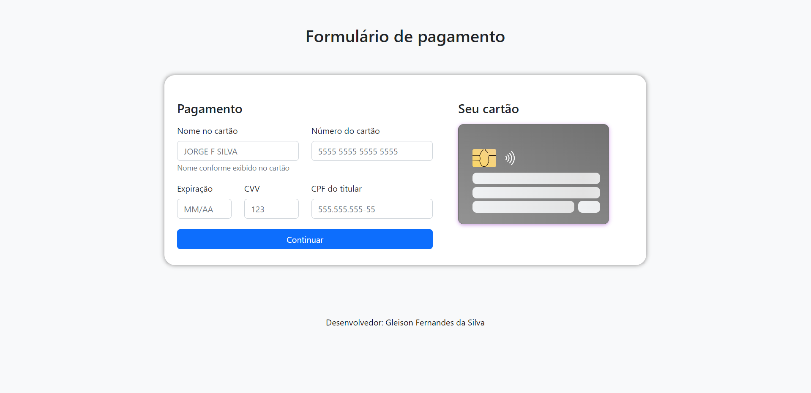

 <h1>Formulário de pagamento</h1>

---

## 💻 Sobre o Projeto

Este projeto consiste em uma aplicação web responsiva.
O <strong>Formulário de pagamento</strong> é uma simulação de preencimento de dados de cartão de crédito, no qual ao preencher os dados automaticamente é demostrada algunhas bandeiras de cartões e os demais dados em um cartão ao lado do furmulário e dependendo da bandeira do cartão a sua cor pode mudar. 
Projeto idealizado no ambito educacional, para o processo de aprendizagem das tecnologias em volvidades.

---

## ✅ Demonstração da aplicação

### 💻 Desktop

<h1 align="center">
  
</h1>

### 📱 Mobile

<h1 align="center">
  
</h1>

---

## 🛠️ Tecnologias Utilizadas

---

## ⚙️ Executando o projeto localmente (Linux ou Windows)

### Pré-requisitos

- Ter um navegador web instalado.
- Git.

### Instalação e execução

- Clone o repositório em um diretório de sua preferência
         
      git clone https://github.com/gleisonfernandes/FumularioPagamento.git

- Abra o diretório do projeto
- Execute o arquivo index.html com o navegador.

---

## 🚀 Estudante

|_Gleison Fernandes_|
|---|
||
|_Desenvolvedor_|
|    |